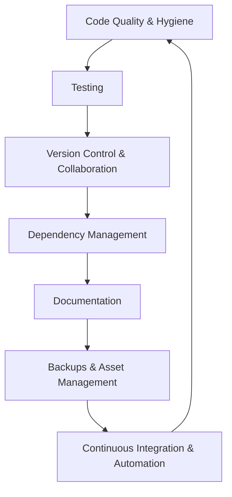

# Maintenance Best Practices and Future Steps for SeanKennethDoherty React Project

## Comprehensive Project Review Summary

- **Project Structure:** Well-organized React project with clear separation of components, hooks, assets, and styles.
- **Dependencies:** Uses React 18, react-scripts, and a few utility libraries. Package scripts support build, start, test, and deployment.
- **Code Quality:** Modular code with custom hooks and components. However, unresolved merge conflict markers exist and should be cleaned.
- **Testing:** Minimal testing coverage with only a placeholder test. Test setup uses React Testing Library and jest-dom.
- **Documentation:** README.md covers setup, usage, and deployment well but lacks testing, contribution, and maintenance sections.
- **Linting:** ESLint configured with react-app presets, but no evidence of formatting tools or CI enforcement.
- **Assets:** Images managed carefully with notes on git inclusion and manifest usage.

## Recommended Future Steps and Best Practices

### 1. Code Quality and Hygiene
- Resolve all merge conflict markers and ensure clean codebase.
- Enforce consistent code style using Prettier and ESLint.
- Integrate linting and formatting checks in CI pipeline.
- Refactor code periodically to improve readability and maintainability.
- Remove dead code and unused assets regularly.

### 2. Testing
- Expand test coverage with meaningful unit tests for components and hooks.
- Add integration tests for key user flows and interactions.
- Use mocks and stubs to isolate tests.
- Run tests automatically on commits and pull requests via CI.
- Document testing strategy and how to run tests in README.

### 3. Version Control and Collaboration
- Use feature branches and pull requests for changes.
- Write clear, descriptive commit messages.
- Protect main branches with review requirements.
- Tag releases or milestones for versioning.

### 4. Dependency Management
- Regularly update dependencies to patch vulnerabilities and gain improvements.
- Use `npm audit` or similar tools to check for security issues.
- Remove unused dependencies to reduce bloat.
- Lock dependency versions for reproducible builds.

### 5. Documentation
- Enhance README with sections on testing, contribution guidelines, and maintenance.
- Document component APIs, hooks, and utilities.
- Use inline comments for complex logic.
- Maintain a changelog for releases and major changes.

### 6. Backups and Asset Management
- Ensure Git repository is regularly pushed to remote (e.g., GitHub).
- Backup important assets and configuration files.
- Automate backups if possible.

### 7. Continuous Integration and Automation
- Set up CI pipeline to run tests, linting, and builds on push and pull requests.
- Automate deployment steps where possible.
- Monitor build and test results to catch issues early.

---

## Maintenance Workflow Overview

This cyclical workflow ensures continuous improvement and project health.

---

This document provides a clear roadmap for maintaining and improving the SeanKennethDoherty React project effectively.